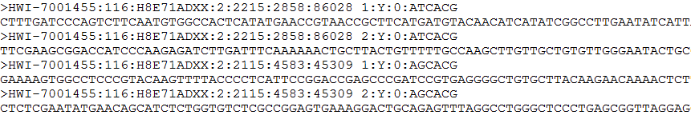
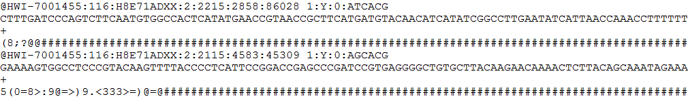

# 常见数据格式说明

##### 数据格式：FASTA

常用扩展名：fasta、fna、fa

文件类型：文本文件

说明：

用于存储核酸或者氨基酸序列信息，每条序列由2部分组成：&gt;开始的行是序列名，可以储存序列的描述信息；其余行是序列部分，下一个&gt;之前的部分都是该序列的信息。

------
##### 数据格式：FASTQ

常用扩展名：fastq、fq

文件类型：文本文件

说明：

高通量测序仪产出数据的一般格式，每条序列由4行组成：第一行以@开头，后面是序列标识（ID）以及其他可选的描述信息；第二行为碱基序列，即Reads；第三行以+开头，后面接着是可选的描述信息；第四行是Reads每个碱基对应的质量打分编码，长度必须和Reads的序列长度相同，该行中每个字符对应的ASCII值减去33/64，即为对应的质量值。

------
##### 数据格式：FASTQ

常用扩展名：fastq、fq

文件类型：文本文件

说明：

高通