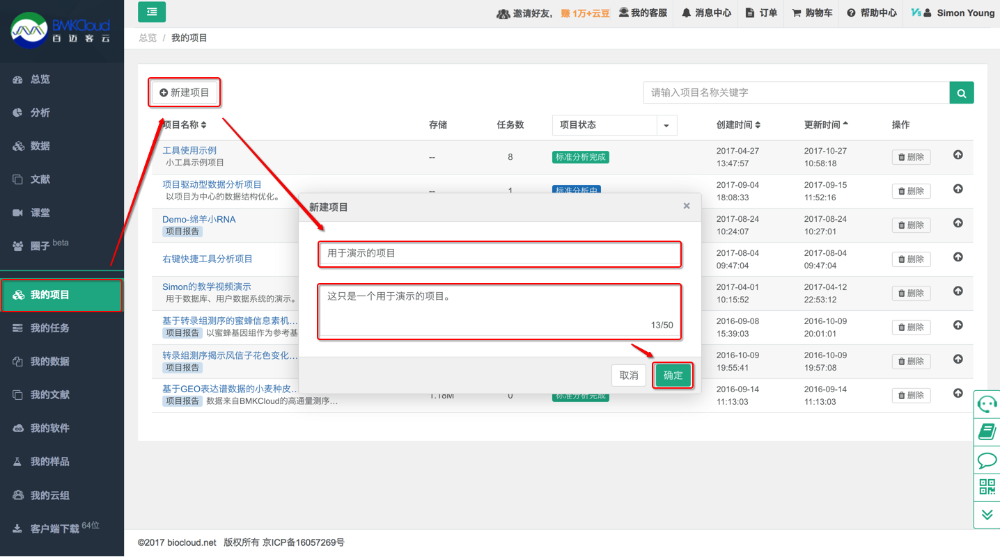
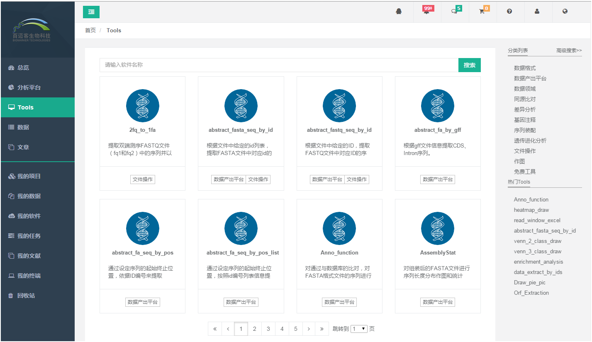

## 快速体验

接下来带您进行一次完整的百迈客云平台体验。

> **[warning]** 在此已默认您登陆百迈客云平台，否则请先[登录](https://international.biocloud.net/zh/user/login)，登陆和注册可以参考[账号设置](account-settings.md)。

### 创建项目

在`我的项目`页面，点击`新建项目`，在弹出对话框中填写项目名称和项目描述，`项目名称`必须输入，且建议只输入中文、数字、字母、中横线、下划线、点等字符，不要输入空格等非常特殊的字符，点击`确定`按钮，新建的项目将显示在项目列表中。

> **[warning] 注意：**
> 如果已经创建了项目，可跳过该步骤。

### 上传数据

您可以单击纵向导航栏中【我的数据】，在【我的数据】中选择【上传数据】上传启动子预测需要fa序列文件。

## 查找软件

点击【我的软件】或【Tools】打开工具列表，在搜索框内输入promoter_predict（支持模糊搜索）点击搜索，点击软件名称进入软件

## 进行数据分析

进入启动子预测软件后，根据软件说明和举例了解软件输入和输出。通过对话框输入输入文件，输入文件序列类型，功能域搜索方式和输出目录等内容。

单击【提交执行】弹出新的页面，在输入任务名对话框中填写任务名，并检查输入内容是否正确。

点击【提交执行】， 任务进入任务详情页面,任务开始自动运行。

## 查看任务
提交执行任务后，可通过点击纵向导航栏中【我的任务】来查看任务的执行状态，

图片中显示，任务处于执行状态——运行中，待任务状态由运行中转换为成功时，可以进入任务详情-结果文件查看任务结果。

如果运行过程中出现错误或者没有结果,您可以联系客服人员处理，我们会及时回复并对您的问题提供最好的解决办法。

## 查看结果

待任务结束，单击任务名称进入任务详情或者进入我的数据中所选输出目录都可以查看、下载结果文件。

> #### danger::注意
>
> 以上内容只是用于演示如何在帮助文档中提示、插入图片等功能，内容
