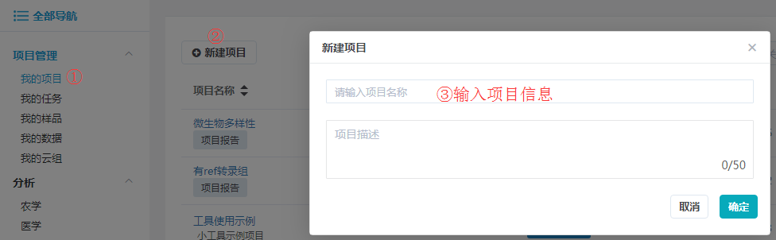

# 快速体验

接下来带您进行一次完整的百迈客云工具使用体验。

> **[warning] 注意：** 在此默认您已登陆百迈客云平台，否则请先[登录](https://international.biocloud.net/zh/user/login)，登陆和注册可以参考[账号设置](account-settings.md)。

## 创建项目

在`我的项目`页面，点击`新建项目`，在弹出对话框中填写项目名称和项目描述，`项目名称`必须输入，且建议只输入中文、数字、字母、中横线、下划线、点等字符，不要输入空格等非常特殊的字符，点击`确定`按钮，新建的项目将显示在项目列表中。

> **[info]** 如果已经创建了项目，可跳过该步骤。

## 上传数据

点击[下载PCA分析示例数据](https://img.biocloud.net/docs/PCA_test_file.txt)，单击左侧导航栏中`项目（管理）-> 我的数据`，然后点击`上传 -> 上传文件`，将PCA分析示例数据上传到我的数据中。

## 查找工具

在`应用中心`后边的检索框内输入工具关键词：PCA ，可以检索出带有PCA关键词的分析工具，点击下拉框中的工具名，则可以快速打开该工具，见下图：

## 开始数据分析

打开PCA分析工具后，左侧是工具的参数填写页面，右侧是工具介绍、参数说明、结果说明，参考参数说明填写对应参数：

1. infile 选择刚才上传到我的数据中的文件 PCA_test_file.txt，实际也可以直接在工具处将本地文件上传进来，从而跳过前边上传数据那一步
2. group 填写：eg1:FL2dR1,FL2dR2,FL2dR3 eg2:FL4dR1,FL4dR2,FL4dR3 eg3:SL2dR1,SL2dR2,SL2dR3

填写完成后，点击`提交`，任务投递成功后会自动跳转到`我的任务`列表页，且任务状态是`运行中`。

## 查看任务和结果

点击任务名称查看任务详情及分析结果，可以看到该任务的输入文件、参数设置、输出文件，以及日志信息和报错信息。

点击`重跑`按钮，可以再次跳转到该任务提交时的参数页面，方便您修改参数后重新进行分析。

> **[info]** 此处仅介绍了云平台上工具的使用，您还可以从头开始分析NGS数据获取分析报告，检索功能基因和公共数据。

## 更多推荐内容

* [分析平台极速体验](workflow-on-bmkcloud/quick-use-workflow.md)
* [工具入门引导](tools-on-bmkcloud/tools-help.md)
* [高通量测序数据库](public-database/sra-on-bmkcloud.md)

[^_^]:
* [功能基因数据库](public-database/gene-database.md)
