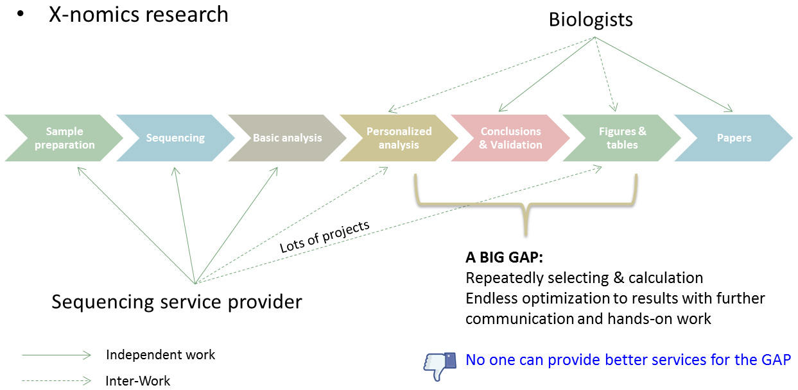
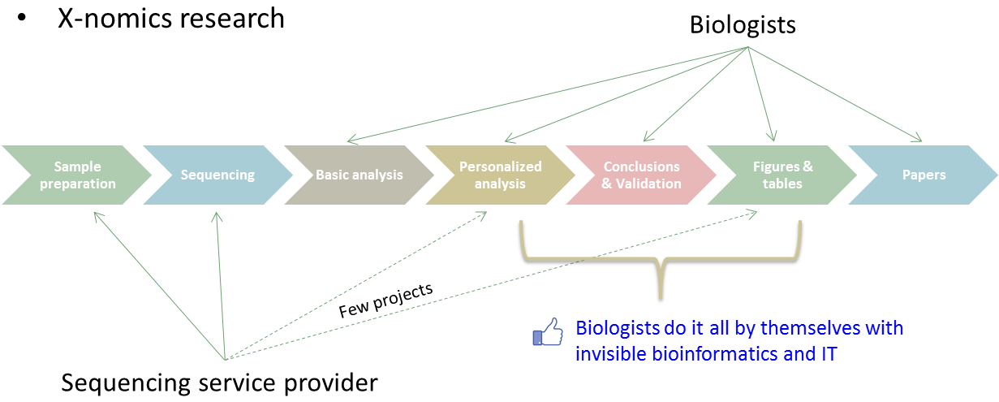
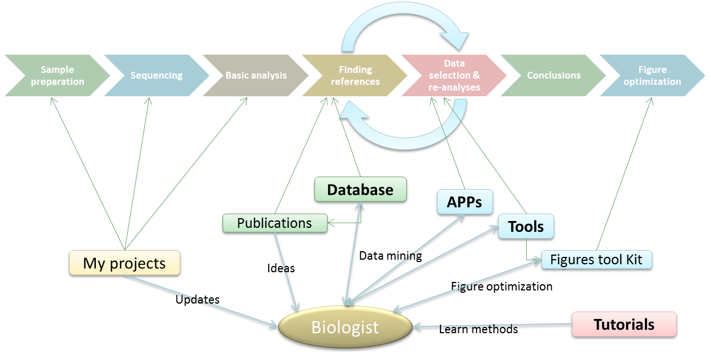

# 平台介绍

百迈客云BMKCloud（[www.biocloud.net](www.biocloud.net)）从2013年开始开发，经过小伙伴们2年多的开发和内部外部测试，以每周一个新版本的迭代速度于2015年正式迈入市场，成为全球第一个针对生命科学家的“Turn-key BioCloud”，2016年开始全国推广。百迈客云得到了像中国科学院院士陈润生院士、中科院基因组所于军研究员、北京大学罗静初教授等中国生物信息领域的权威专家的大力支持和帮助。百迈客云日臻完善，可以开放的让科研工作者来体验和使用，目前已经有上万科研用户注册使用，开启了云端自主数据深入挖掘的新时代。得到广大科研用户的肯定是对我们最大的鼓励，百迈客“云模式”将持续迭代开发，继续引领科技服务2.0时代，更好的服务于科研工作者，加速科研创新，“成就客户”是我们服务的理念，让每一个课题组都具备生物信息分析能力，让每一位科学家能从百迈客云模式中受益。

百迈客云提供了“云服务”和“云账号”两种模式。 “云服务”是测序分析的项目以“云服务”的模式开展，所有的项目数据都会推送到云上，标准分析都由技术人员完成，项目相关的数据深入挖掘和个性化分析部分由技术人员带领客户在云上进行，客户也可以自主在云端进行数据分析，简单来说就是数据分析科研人员想自己做就自己做，不想自己做就交给公司做，这种模式能够解决服务公司售后个性化分析期限的问题，科研人员可以在云上进行分析，直到文章的发表；“云账号”主要针对做过或熟悉高通量测序，手里有一些没有完全挖掘的数据，还想充分利用公用数据的用户，经过简单的培训后，就可以在云平台上自主分析数据，多种分析软件都可以使用，深入挖掘自己以前的所有项目数据，也可以利用NCBI等公共数据进行挖掘研究，课题组的多个成员可以同时开展多个项目，提高研究的效率。

## 百迈客云定位

在多组学背景下，标准化的生物信息数据分析已经远远不能满足科研需要，每项课题后期都要不断进行深入挖掘，不断的修正参数、不断的重新绘图等等，对于没有数据分析技能的研究人员来讲确确实实是一个通点，即使科技服务公司可以提供一些技术支持，但多环节沟通导致科研效率明显降低，因此能够帮助研究人员真正实现自主数据分析显得越来越迫切，百迈客云也是在这种背景下，应运而生。

传统模式中的科研痛点

借助百迈客云解决痛点

## 百迈客云提供的功能

* 项目管理
* 生物信息数据分析：标准分析+个性化数据挖掘
* 公共数据检索和下载
* 在线培训

## 推荐内容

* [马上开始](get-started/quick-start.md)
* [创建项目](get-started/quick-start.md#创建项目)，这里演示锚定到其他页面的章节。
* [项目管理](manage-an-analysis-environment.md)
