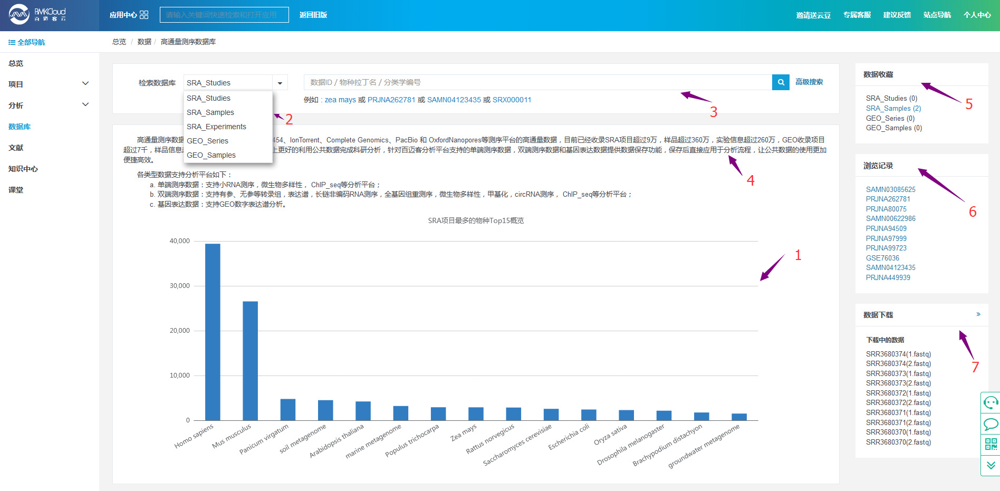
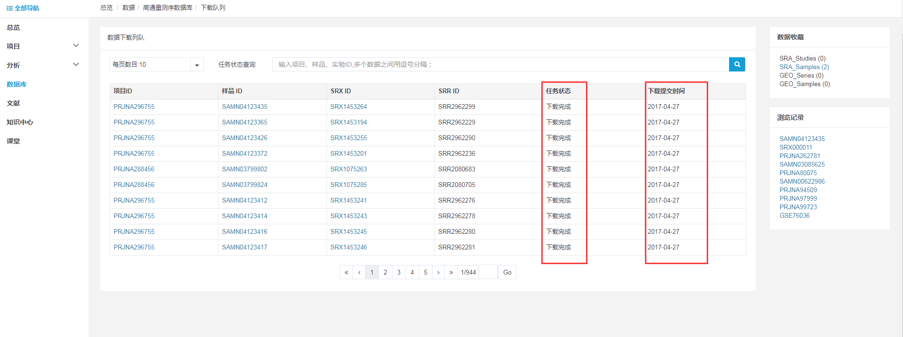
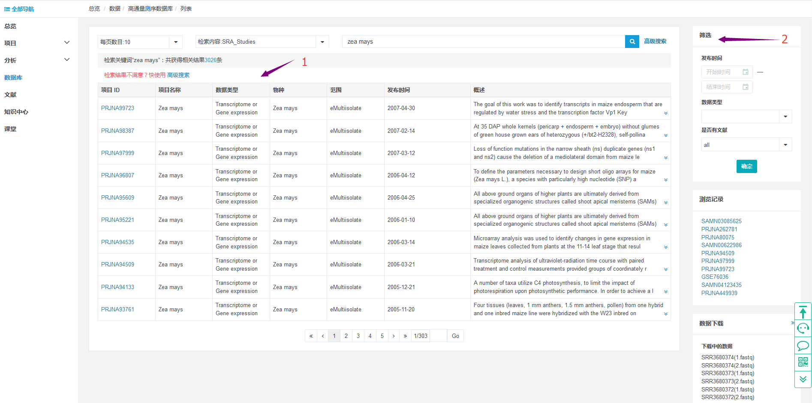
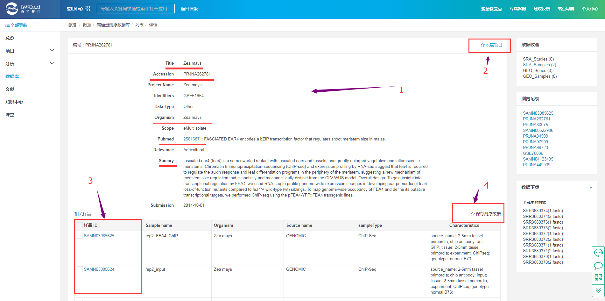
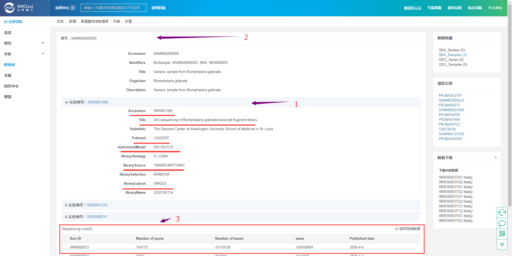

# 关于公共数据库

为了充分利用公开的SRA数据，实现最大化的利用数据，多维度、多角度的对公开的SRA数据进行深度发掘，我们整合了NCBI的所有的SRA公共数据。

## 高通量数据库的使用指南

1. **名词解释**

	针对数据库可能出现的名词，做一下解释：

	SRP:项目编号;
	
	SRS:样品编号;

	SRX:实验编号;

	GSE：项目编号，即一个实验项目中的多个芯片实验，可能使用多个平台，可能涉及多个样本; 
   
	GSM:样品编号，即单个样本的实验数据;

	原始测序数据(SRR)。

2. **高通量数据库介绍**
	
	点击左侧导航的“数据库”，在数据库主页面中点击“高通量数据库”，即可进入此SRA数据库中进行查阅、检索：
	
		

	标号“1”，以柱状图的形式统计出SRA项目最多的前15个物种的信息，点击默认的是，以特定的“物种”在SRA数据库中进行检索。

	标号“2”，下拉框中说明“高通量数据库”中的5个子库分别是哪些：SRA的项目、SRA的样品、SRA的实验、GEO的项目、GEO的样品。

	标号“3”，确定要在哪个子库中进行搜索框后，在搜索框中输入物种名、项目ID、实验ID或样品ID进行检索即可。

	标号“4”，描述了目前SRA数据库中收录的数据信息。

	标号“5”，“数据收藏”即为曾经在“高通量数据库”中进行收藏的数据的统计。

	标号“6”，“浏览记录”即在此数据库中曾经做过的检索，保留了最新的10条检索记录。

	标号“7”，“数据下载”即平台上所有的下载数据的进度情况（包括他人的，方便了解目前平台下载情况），如下图：

	

	可以查看目前数据下载的具体情况，如“任务状态”、“下载提交时间”等。

	注：SRA_Studies：项目信息；SRA_Samples：样品信息；SRA_Experiments：实验信息；GEO_Series：GEO项目信息；GEO_Samples：GEO样品信息

3. **数据库检索结果解读**

	下面以物种“zea mays”作为检索关键字进行结果的解释：

	3.1 **以物种作为检索关键字的结果页**
		
		

	标号“1”，在子库“SRA studies”中，以“zea mays”检索的结果列表：

	“项目ID”，出现此物种的所有的SRA项目ID；

	“数据类型”，特定项目中的测试数据的类型；

	“发布时间”，特定项目数据公布的时间；

	“概述”，特定项目的目的、总结。

	标号“2”，可以对检索得到的结果列表，做进一步的帅选：

	条件1：“发布时间”，可以筛选，特定的起始时间，终止时间范围内的数据的信息，eg:起始时间：2017-09-20  结束时间：2018-09-21

	条件2：“数据类型”，点击下拉框，可以筛选特定的数据类型的数据，eg:assembly

	条件3：“是否有文献”，点击下拉框，可以筛选出包含（yes）、不包含(no)或所有的(all)项目数据。

	选择了3个条件中的任何一个，点击“确定”，即可以在总的结果列表中进行筛选了。

	3.2 **项目ID对应的详情页面**

	点击“项目ID”，即可得到此项目ID的详情页面：
		
		
	
	标号“1”，是对整个项目的总体介绍。只有检索的关键字出现在“Title”或“Summary”中即可作为检索结果。

	点击“Pubmed”，可以查看文献的详情信息。

	标号“2”，如果此项目数据对自己有一定的价值，可以通过“收藏项目”见项目信息保存下来，便于后期查看。

	标号“3”，此项目对应的所有的样品的信息，包括样品ID、样品的名称、物种来源、数据类型、测序类型、样品的一些简单的处理等描述信息；

	标号“4”，选择有用的样品信息，点击“保存测序数据”即可以将数据下载下来，用于后期App分析等使用。

	具体的下载进度，可以点击右侧的“数据下载”查看。

	点击列表中的“样品ID”，可以得到样品的详情信息，见下文3.4。

	3.3 **实验ID对应的详情页面**

	通过实验ID进行检索得到的详情页面：
		
		

	标号“1”，是对检索的实验ID的详情描述信息，包括，实验对应的文献、此实验的测序平台、测序类型、单双端信息等等。

	标号“2”，因为一个样品可能存在于不同的实验条件下，但是一个实验肯定属于一个样品，因此以样品ID为主导，将相关的实验关联在一起了。

	因此在实验检索结果页面上，可能会看到多个实验ID的信息。

	标号“3”，但是下面的测序Run信息是与特定的SRA 实验ID相对应的。 也就是说点击不同的SRA 实验ID 可得到与之对应的测序数据的信息。

	点击“保存测序数据”，即可以进行数据的下载了。

	3.4 **样品ID对应的详情页面**

	通过样品ID进行检索得到的详情页面：

	![入口1](操作说明图片/样品ID的详情-5.png）

	标号“1”，是对应这个样品的描述信息，包括这个样品对应的项目编号、物种、这个样品对应的组织样的采集、处理等条件。

	点击项目ID，可以查看项目的详情---对应页面解释如3.2

	标号“2”，是对应的这个样品的实验的描述信息，默认的情况下，我们展开的是第一个实验ID的信息。

	标号“3”，就是这个样品的测序情况。

	3.5 **GEO项目ID对应的详情页面**

	通过GEO子库检索项目ID得到的详情页面：

	除了此项目创建的背景的介绍等信息，还包括了此项目下对应的样品的信息。

	![入口1](操作说明图片/GEO-项目ID详情-7.png）

	3.6 **GEO样品ID对应的详情页面**

	通过GEO子库检索样品ID得到的详情页面：

	包含了详情的样品的组织样收集信息，测序信息、提交者信息、提交日期更新日期等信息。

	![入口1](操作说明图片/GEO-样品ID详情-8.png）

## SRA和GEO数据库的优势

	（1）将SRA和GEO测序数据部署到云平台，使得用户更加快速、便捷的检索到特定物种的特定数据。
   
	（2）SRA和GEO数据库可以与云平台的APP想关联，利用公共数据结合APP进行数据深入挖掘。

## 应用场景
	
	（1）野生大豆泛基因组测序解密大豆遗传多样性及重要农艺性状基因：
        
	 中国农业科学院蔬菜花卉研究所自己测的7株野生大豆结合国外测的栽培性大豆，对野生大豆进行变异检测等进化研究等分析。
	
	（2）2016年在Biotechnology for Biofuels（IF 6.044）上再次发表了一篇文章《SorGSD: a sorghum genome SNP database》，构建了48个高粱品系总计62.9MSNPs的数据库SorGSD，其中44个高粱是2014年由澳大利亚昆士兰大学、深圳华大等单位合作测的44个高粱重测序与2011年甜高粱和籽实高粱的全基因组遗传变异的数据结合构建的。
