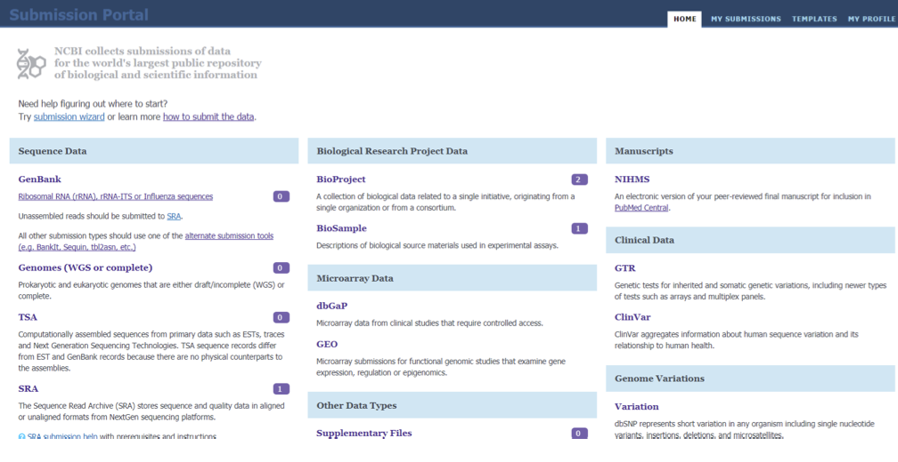
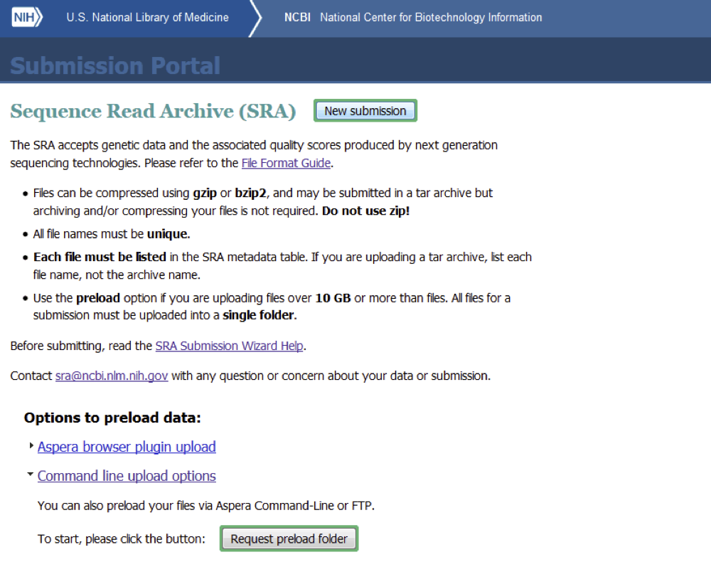
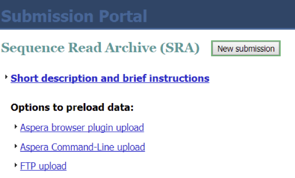
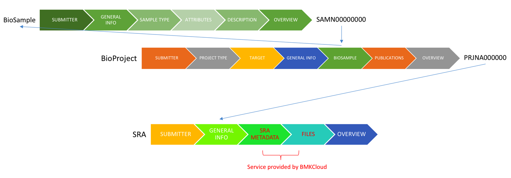

# 提交测序数据到SRA

使用工具 submit-FASTQ-to-SRA ，可以直接将百迈客云上的FASTQ格式的测序数据传输到SRA数据库，并获得SRA需要的测序数据的元数据（metadata）。

提交测序数据到SRA数据库，需要用户先注册NCBI账号，并获取SRA上传目录。

# 获取SRA上传目录

1. 登录NCBI上传[主页](https://submit.ncbi.nlm.nih.gov/)，如果没有NCBI帐号，需要先注册。

2. 在右上角选择“HOME” 选项卡，在页面上找到 **Sequence Data** 分类下的 SRA(如下图) ，点击SRA 。

3. 新的页面应该如下所示。
点击 _Command line upload options_ ，再点击 Request preload folder 按钮，即可获取NCBI分配的个人上传目录。

4. 经过上一步后，应该能看见如下页面。点击 _Aspera Command-Line upload_ 或 _FTP upload_ 即可看到对应的上传目 录。
上传目录命名规则是 “用户邮箱 + 下划线 + 8位随机字符”，例如:simonyoung2014@icloud.com_5q8Qb0zL

# SRA数据提交步骤

用户提交测序数据到SRA数据库，需要经历以下几个步骤：

1. 创建项目（BioProject）
2. 创建样本（BioSample）
3. 传输测试数据到SRA
4. 创建SRA数据提交任务
    a. 创建实验（Experiment），并关联项目（BioProject）和样本（BioSample）
    b. 上传SRA需要的测序数据对应的元数据
    c. 指定实验对应的测序数据文件
5. 编辑PubMed链接、发布时间等信息

流程如下图所示：

