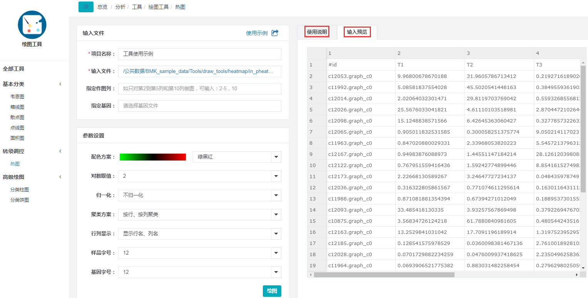

# 绘图工具

绘图工具集成了多款数据展示工具，在方便总览数据的同时，还可：1.调整绘图——以最佳方式展示数据的分布；2.交互查看——点击图片相应区域，查看对应数据详情。

目前可绘制图形包括：热图、韦恩图、柱图、饼图、箱线图、散点图、点线图、面积图，以下以热图为例，对绘图工具进行使用说明。

## 基本使用

可以参考[工具入门引导](tools-help.md)了解工具的一般使用方法，下图为热图的主界面，同样左侧是参数页面，右侧是工具说明页面，与普通工具不同之处：

1. 导入数据之后，可以对数据进行预览；

2. 任务运行成功之后，会跳转到结果交互页面，支持修改图片演示，及下载数据。

