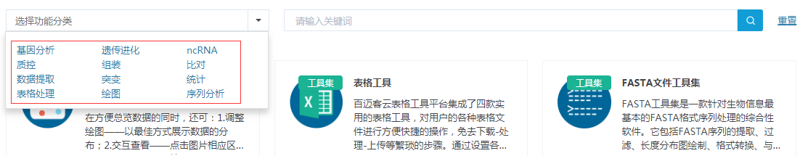
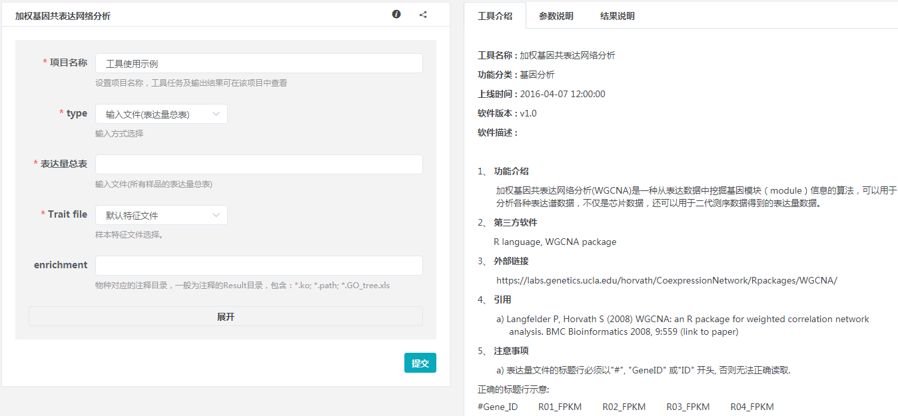
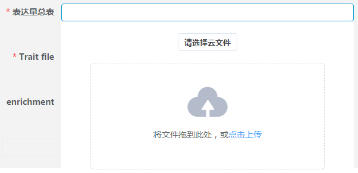
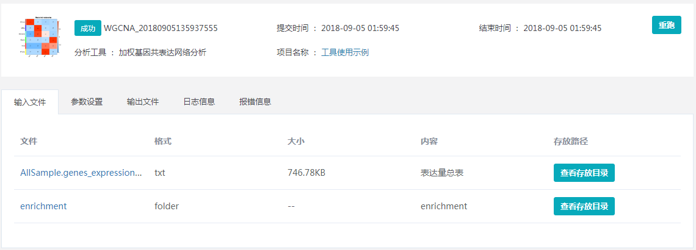

## 工具入门引导

### 工具检索

1. 在下方输入框内，直接输入关键词，在所有工具中进行检索。
2. 也可以先选择某个分类，选择分类后，下方会列出当前分类对应的所有工具，可以直接查看哪个工具是自己需要的，也可以再输入关键词在当前分类中进行检索。

### 工具使用

点击图标打开工具，以[加权基因共表达网络分析](https://international.biocloud.net/zh/software/tools/detail/small/8a8300b253cf73e70153d16368250f32)为例，对工具的基础使用方法进行介绍。左侧为工具的参数填写页面，右侧是工具介绍、参数说明、结果说明。

* 工具介绍，对工具中使用的第三方软件及方法进行了说明，并列举了工具使用过程中的注意事项，请您在使用时留意。
* 参数说明，详细的对每个参数的含义进行了解释，您在填写参数时可以一一对照填写。
* 结果说明，对分析结果中包含的主要结果文件，以及文件内容进行了详细的说明。

##### 工具快速体验

点击`使用示例`，系统会自动填充输入文件及参数，点击`提交`，完成示例数据的分析，页面会自动跳转到`我的任务`页面，点击任务名称查看任务详情及分析结果。

主要目的是通过示例数据分析，让用户快速了解该工具的分析内容。

##### 真实数据分析

1. 数据导入，现在支持2种数据导入方式：

* 点击`请选择云文件`，选择`我的数据`中的数据进行分析；
* 直接上传本地文件进行分析，可以直接将文件拖拽到提示处，也可以`点击上传`选择本地文件后上传。

2. 导入文件校验

* 选择云文件时，系统会提示支持文件类型，如下图，请选择符合要求的文件类型，否则不能导入；
    
    
* 文件不能为空，不能包含中文；
* 使用单个或多个制表符分割后，所有行的列数要保持一致；
* 不能所有行都以#号开头。

3. 参数填写

* 带有*号的参数为必填参数；
* 点击`展开`可以看到该工具的更多参数，当参数比较少时，没有改选项。

### 工具任务查看

任务提交成功后会自动跳转到`我的任务`页面，点击任务名称查看任务详情及分析结果。

下图为任务详情页面，可以看到该任务的输入文件、参数设置、输出文件，以及日志信息和报错信息。

点击`重跑`按钮，可以再次跳转到该任务提交时的参数页面，方便您修改参数后重新进行分析。

