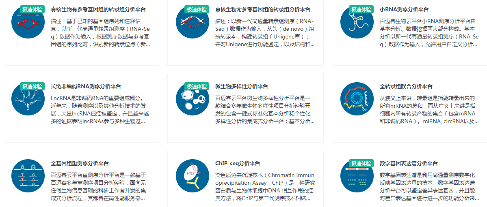
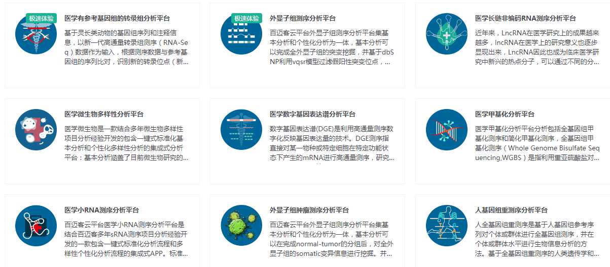
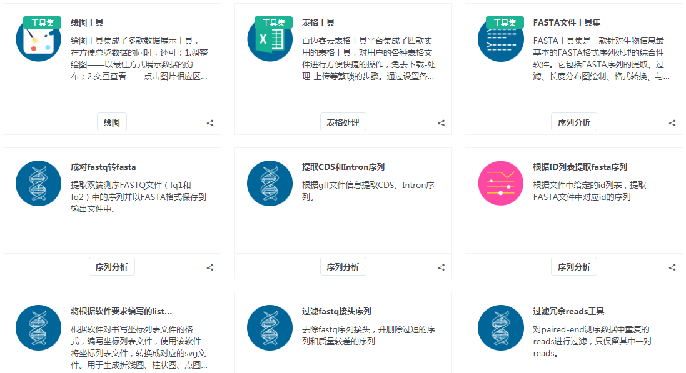

## 分析

数据分析功能是百迈客云最核心的功能之一，分析功能又分为两大类型，分析平台和分析工具，通过界面式操作，帮助用户轻松搞定生物大数据的分析。

### 分析平台

分析平台功能包含两大部分：基本分析和个性化分析。

基本分析集成了一系列生物信息分析软件，并将其无缝串联起来，形成一个标准化的分析流程，在基本分析中您可以根据研究需要自由定义各步骤的主要参数，如参考基因组、差异分组、差异基因筛选标准等。目前百迈客云包含丰富的分析流程，涵盖转录组、非编码RNA、微生物、蛋白、代谢、联合分析等，通过这些分析流程，从原始数据开始，只需轻松几步，即可获得内容丰富的标准分析报告，再也不用等待科技服务公司排队进行分析，是传统科技服务模式的替代品。

个性化分析是在基本分析结题报告的基础上，进行更深入的二次挖掘，或者做一些更高级的分析，并支持重新绘图等。

[农学分析平台](https://international.biocloud.net/zh/software/agriculture/list)

[医学分析平台](https://international.biocloud.net/zh/software/medical/list)

### 分析工具

工具一般是实现相对独立的功能，如绘制热图、绘制维恩图、序列比对、构建进化树等，针对比较个性化的分析内容，您可以通过串联几个工具来实现。相比分析平台，工具更灵活，但是工具不会生成完整的分析报告。

目前百迈客云平台包含3款工具集:
1. [绘图工具](https://console.biocloud.net/static/index.html#/drawtools/intoDrawTool)：热图、维恩图、柱状图、饼图等
2. [FASTA文件工具集](https://console.biocloud.net/static/index.html#/fastatoolset/0/dataimport)：提取、合并切分、转换、统计
3. [表格工具](https://console.biocloud.net/drawtools/formTool/formEdit#!/)：表格排序、筛选、合并

以及100+其他类型的工具，涵盖：绘图、质控、数据提取、序列分析、比对、统计、遗传进化、基因分析、组装、ncRNA等。

