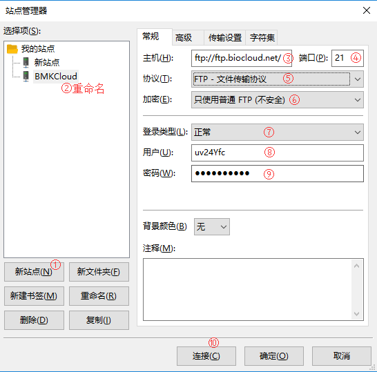

## 数据上传

### 网页直接上传

由于网页文件传输受网络稳定性影响很大，网络出现任何一点异常，都会导致数据传输异常，因此当文件超过200M时，强烈建议使用FTP上传数据，否则很容易导致上传的数据不完整，而影响使用。

点击`项目（管理）` -> `我的数据` -> `上传` -> `上传文件` 打开数据上传弹框，点击`上传`选择文件，支持一次选择多个（选择文件时按住Shift键进行多选）文件同时上传，点击`确定`开始上传，上传过程中不能关闭弹框，上传成功后，该弹框会自动消失。

> **[warning]**
>
> 文件小于200M可以选择这样上传，大于200M请使用FTP上传

> 上传的文件名不能包含中文及特殊字符，建议使用字母、数字、中横线、下划线、点

### FTP上传

点击`FTP上传`之后，系统会自动给您开通百迈客云FTP账号，同时系统会给您平台绑定的邮箱发送一封邮件，邮件中包含了FTP账号和密码，以及使用说明，请您按照邮件中提示进行数据上传，遇到问题可以随时联系在线客服。

操作步骤如下：

1. 首先将要上传的数据打包压缩成后缀为tar.gz、tar.bz或者zip的压缩文件，以便缩短上传时间，千万不要压缩为rar格式的；

2. 登陆FTP客户端，如果没有安装，点击[FTP客户端下载](https://filezilla-project.org/download.php?type=client)，然后安装后使用，参考下图填写您专属的FTP账号和密码，**输入时千万不要在前后输入任何空格**，否则会导致不能登陆；

    
3. 参考下图，通过FTP将已经压缩好的文件上传到云平台集群，等待上传完成，注意观察下图④位置，确保数据全部上传成功之后，再上传一个finish文件，[点击下载到本地](https://img.biocloud.net/docs/finish)，切记要等待数据上传完成之后再上传finish文件，目的是告知系统我的文件已经传输完毕，可以进行后续操作；

    
4. 根据上传文件的大小，**5-30分钟**后（上传的压缩文件越大需要的解压时间也就越长）可以在`项目（管理）` -> `我的数据` -> `ftp_upload` -> `2018mmddhh`文件夹中查看您的文件是否上传成功，且系统会自动帮您解压。

    

> **[warning]**
>
> 上传的压缩文件名不能包含中文及特殊字符，建议使用字母、数字、中横线、下划线、点

> 如果是测序公司提供的原始测序数据，则一般是gz压缩格式，就不需要再压缩了；非压缩格式，windows下建议压缩为zip格式

> 数据上传之后由于系统要对文件进行解压，因此请您耐心等待5-30分钟后，数据才能推送到您的账号下

### FTP登陆常见报错及解决办法

1. 错误：530 Login authentication failed

    解决办法：检查FTP主机、用户名、密码等信息是否填写正确，建议直接复制系统发送的信息，但是注意不要复制上前后空格。
2. 错误：

    响应:	220-This is a private system - No anonymous login
    响应:	220-IPv6 connections are also welcome on this server.
    响应:	220 You will be disconnected after 15 minutes of inactivity.
    命令:	AUTH TLS
    错误:	无法连接到服务器
    
    解决办法：通过站点管理器添加新站点，并修改FTP登陆时的一些高级参数，在FTP页面，点击`文件` -> `站点管理器`按照下图添加新的站点：
    
    
    
    设置成功后，点击`连接`，在弹框中输入密码，点击确定，完成连接：
    
    
    