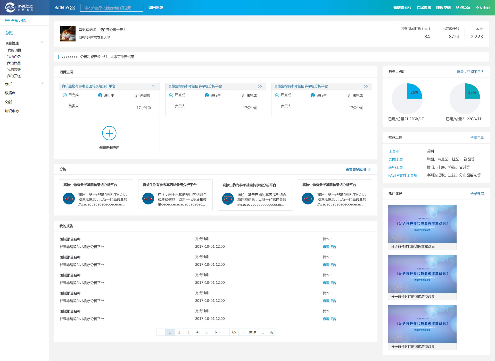

# 总览页

1. 应用中心

    鼠标悬停到`应用中心`可以展示出`热门应用`、`已购买分析平台`、`农学分析应用`、`医学分析应用`、`分析工具`，方便您快速打开目的应用，开始进行分析。

2. 输入关键词快速检索和打开应用

    输入关键词快速检索您想要的应用，并快速打开检索到的应用，我们会在工具的中文名及英文名中同步进行检索，尽可能保证您可以检索出想要的应用。

3. 个人中心

    鼠标悬停到`个人中心`可以签到、查看套餐信息、存储空间、消息通知等，点击“个人设置”可以进行个人信息的设置。

4. 项目进展

    在`项目进展`部分展示了最新有进展的项目，您可以一目了然多个项目目前所处的环节；点击`创建项目`可以创建新的项目。

5. 分析

    此处展示了使用频率最高的4个分析平台。

6. 我的报告

    此处您可以直接看到结题报告报告，而不必先进入项目，更加的方便快捷。

7. 使用占比

    使用占比中，显示了存储空间和数据分析流程使用情况。

8. 推荐工具

    列举了几款使用频率最高的工具。

9. 热门课程

    展示了访问次数最多的几个免费视频，可以直接点击观看。

