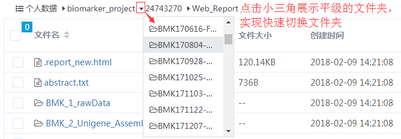
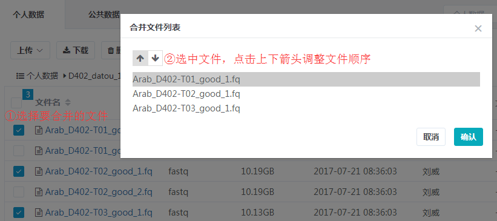
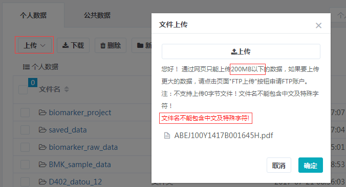

## 项目管理

百迈客云平台以项目为中心，将项目进展、任务、数据、样品信息等统一放到项目中进行管理。

### 我的项目

#### 创建项目

##### 自建项目

在`我的项目`页面，点击`新建项目`，可以开始创建自己的项目，如下图，`项目名称`必须输入，且建议只输入中文、数字、字母、中横线、下划线、点等字符，不要输入空格等非常特殊的字符，`项目描述`中可以填写一些关于该项目的详细说明，便于对该项目的内容有一个大致了解。


##### 云服务项目

由科技服务部分析完成的项目，简称`云服务项目`，运营人员会通过后台管理员系统给您创建一个项目，并将结题报告推送到该项目中，之后您便可以在云上直接查看结题报告，并进行一系列个性化分析。

### 项目进展

##### 项目进展自动同步给用户，用户可以在电脑端和微信端进行查询

##### 用户可以催进展，运营收到后可以直接在系统上回复

##### 用户可以就项目的不同阶段进行满意度评价

##### 销售可以在微信端查看自己负责客户的项目进展


### 我的任务

当您通过[分析平台](https://international.biocloud.net/zh/software/agriculture/list)或者[工具](https://international.biocloud.net/zh/software/tools/list)提交一个任务之后，可以到`我的任务`中查看任务的详情，任务列表如下图：


#### 任务筛选

点击任务列表左上角的`任务名称`，通过输入工具名或者任务提交时间对任务进行筛选，如下图：


#### 任务详情

点击任务列表的第一列`任务名称`可以查看任务详细信息，包含任务基本信息、输入文件、参数设置、输出文件、日志信息、报错信息。


### 我的数据

#### 目录说明
```
我的数据
├── 个人数据
    ├── biomarker_project #项目数据目录，存放项目的分析结果文件等
    ├── biomarker_raw_data #存放推送数据时“是否推送固定目录”选择为“固定”时的数据
    ├── saved_data #该目录存放从各数据库中保存入的数据
    │   ├── gene_data #从功能基因数据库保存的数据
    │   ├── GEO #从GEO数据库保存的数据
    │   └── raw_sequencing_data #从高通量测序数据库保存的数据
    ├──Tools_files
    │   ├── Tool_input #工具和个性化使用时直接从本地上传的输入文件，按照年月进行命名
    │   └── Tool_output #工具的输出目录，以工具名和时间戳方式命名
    ├── ftp_upload #ftp上传后数据存放目录
    └── files #用户自己创建的目录或者上传的数据

├── 公共数据
    ├── BMK-Genome_data #百迈客云参考基因组数据库目录
    ├── BMKCloud_Getting_Started.pdf #百迈客云用户快速入门手册
    ├── BMK_sample_data 
    │   ├── APP #分析流程测试数据目录
    │   └── Tools #工具测试数据目录
    └── BMK_user_manuals #百迈客云用户使用手册目录
```
> 以上目录（除去自己创建或者上传的files）都是系统创建的，因此目录名都是固定的

#### 功能说明

```
graph LR;
    mydata(我的数据) --> quick-button(快捷按钮);
    mydata(我的数据) --> more(更多按钮);
    mydata(我的数据) --> right(右键功能);
    mydata(我的数据) --> count(选择计数);
    mydata(我的数据) --> pdir(快速切换目录);
    mydata(我的数据) --> search(文件检索);
    
    quick-button(快捷按钮) --> func(上传, 下载, 删除, 新建文件夹);
    more(更多按钮) --> func1(移动到, 复制到, 文本合并, 查看属性, 上传到SRA);
    right(右键功能) --> func2(打开, 下载, 重命名, 删除, 移动到, 复制到, 打开所在目录, 查看属性, 上传到SRA);
    right(右键功能) --> func3(右键工具: 格式转换, 文本处理, fasta工具, fastq工具);
```

##### 快速切换目录

如下图所示，点击下拉列表中的目录，可以实现快速进入对应目录



##### 文本合并

选中**2个以上**的**文本文件**文件，可以进行此项操作，云平台上的文本文件包含以下所有类型，同时支持调整所选择的样品的顺序
```
graph TB;
    txt(txt) --> fasta(fasta);
    txt(txt) --> fastq(fastq);
    txt(txt) --> xls_txt(xls_txt);
    txt(txt) --> vcf(vcf);
    txt(txt) --> sam(sam);
    txt(txt) --> gff(gff);
    
    xls_txt(xls_txt) --> bed(bed);
    xls_txt(xls_txt) --> exp(exp);
    xls_txt(xls_txt) --> ed(ed);
    xls_txt(xls_txt) --> sv(sv);
    xls_txt(xls_txt) --> idxy(idxy);
    xls_txt(xls_txt) --> density(density);
```



#### 文件检索

1. 支持分别在`个人数据`和`公共数据`中进行检索，选中`个人数据`显示如下：

    

2. 支持文件类型的选择
3. 支持文件大小的选择，可以设置文件大小的筛选范围，并支持修改文件大小单位（KB、MB、GB）
4. 支持通过创建日期进行筛选
5. 检索结果如下：

    

#### 文件上传

1. 直接上传，由于网页文件传输受网络稳定性影响很大，因此当文件超过200M时，强烈建议使用FTP上传数据，否则很容易导致上传的文件不完整，而影响使用。

    

2. FTP上传
    
    点击`FTP上传`之后，系统会给您平台绑定的邮箱发送一封邮件，邮件中包含了FTP账号和密码，已经使用说明，请您按照邮件中提示进行数据上传，遇到问题可以随时联系在线客服。
    
### 我的样品