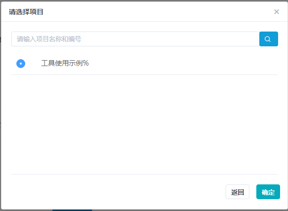

# 个性化定制

百迈客云平台针对服务类用户，提供的个性化管理模块

## 创建定制

1. **自行匹配项目**

	用户可通过在项目列表页中，点击个性化定制按钮，如图：

	

	在弹出的项目列表中查找需要定制的项目，如图：

	

	如果在弹出的列表中没有需要匹配的项目，则可点击关联项目查询。系统会将用户历史的关联项目（非项目列表中的项目），以列表的形式展示出来，用户可在该列表下选择匹配的项目。

	

	匹配项目后，根据系统弹出的内容，填写相应的信息，完成个性化定制的创建(详细填写规则见创建规则)

2. **默认匹配项目**

	用户进入相应项目，在该项目中点击创建个性化定制，如图：

	

	点击后，跳转至创建个性化定制页面，填写相应信息，完成个性化定制的创建(详细填写规则见创建规则)

## 创建规则

1. 标题：输入长度不在50个字以内，且必须填写定制化标题

2. 描述：用户在创建个性化定制过程中，必须填写定制化描述内容以便运营人员了解定制需求

3. 附件：支持多种文件上传，如“word、pdf、excel等”，但是该文件不可超过50M，每次创建个性化任务，最多可上传5个附件

4. 提交：点击提交按钮后，则创建成功个性化定制

5. 取消：点击取消按钮后，则退出创建个性化定制

## 查询进展

用户在创建个性化定制成功后，可在个性化定制进展中查询其进度，以便实时了解，并可在本页面中切换不同的个性化定制项目，进行查看相应的项目进度

## 查询定制化详情

用户在定制化进展页面中，点击左上角定制化详情按钮，可查看该定制化的详细信息

## 催进展

与用户确认定制化任务的内容与期限后，该任务则会根据工作流程进行处理。用户可在相应的工作阶段进行催进展。

## 质疑结果

在定制化结束阶段，用户可对本次的结果，进行质疑。点击质疑后，填写相应的质疑原因说明。系统会重新处理本次的定制化任务。

## 评价

用户在定制化结束阶段，可对本次的任务进行评价，以评星形式进行评价。对于不满5颗星的评价，可选择不足的原因标签。

