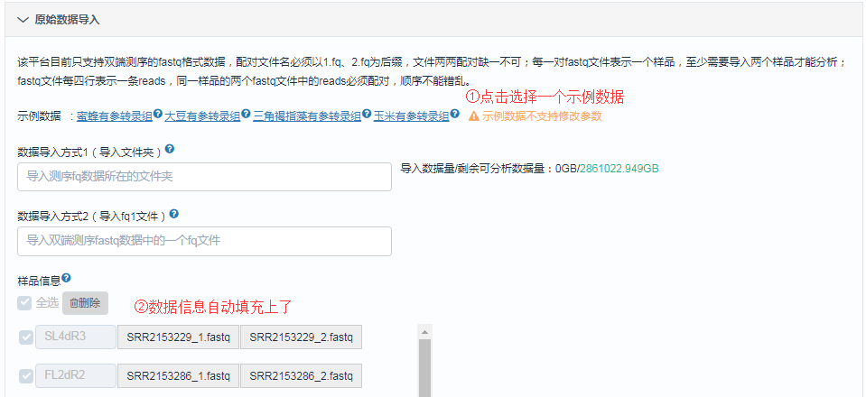
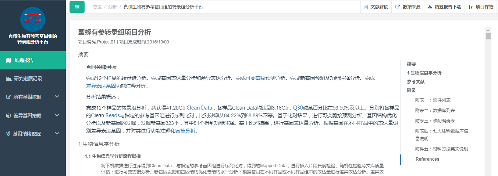

# 分析平台极速体验
极速体验是百迈客云提供给用户快速体验分析平台的功能。通过极速体验，用户可以利用**文章中的真实数据或百迈客云提供的Demo数据**在15分钟内体验自己感兴趣的分析平台的主要功能，包括分析平台**基本分析功能**及**个性化分析功能**。

目前支持极速体验的分析平台包括：
#### 农学分析平台
* [真核生物有参考基因组的转录组分析平台](https://international.biocloud.net/zh/software/agriculture/detail/8a817f674fd9e535014fda7080080a9b)
* [真核生物无参考基因组的转录组分析平台](https://international.biocloud.net/zh/software/agriculture/detail/8a817f674fd9e535014fda7131d30a9f)
* [小RNA测序分析平台](https://international.biocloud.net/zh/software/agriculture/detail/8a817f674fd9e535014fda728ed70aa9)
* [长链非编码RNA测序分析平台](https://international.biocloud.net/zh/software/agriculture/detail/8a817f674fd9e535014fda734dd30aad)
* [微生物多样性分析平台](https://international.biocloud.net/zh/software/agriculture/detail/8a817f674fd9e535014fda746c8f0ac1)
* [蛋白质组分析平台](https://international.biocloud.net/zh/software/agriculture/detail/8a8300b2643577f3016439ffb79b0169)
* [代谢组分析平台](https://international.biocloud.net/zh/software/agriculture/detail/8a8300b2643577f301643a00c88f016e)

#### 医学分析平台
* [医学有参考基因组的转录组分析平台](https://international.biocloud.net/zh/software/medical/detail/8a8300b85373df4b015373f16e1a0037)
* [医学小RNA测序分析平台](https://international.biocloud.net/zh/software/medical/detail/8a8300b853639d27015363a1766f002c)
* [外显子组测序分析平台](https://international.biocloud.net/zh/software/medical/detail/8a817f674fd9e535014fda73caae0ab3)

## 开始极速体验
1. 账号注册及登录

    首先您需要有一个百迈客云账号，并登陆账号，注册账号请参考[账号注册](../get-started/account-settings.md)。
2. 选择您感兴趣的分析平台
    
    点击以上平台名称快速跳转到分析平台， 也可以在`总览页`点击`分析`查看所有分析平台列表，点击带有`极速体验`图标的分析平台。
    
3. 以`真核生物有参考基因组的转录组分析平台`为例演示

    打开该分析平台后，点击`运行软件`，进入分析平台之后，我们可以参考本文档快速进行体验，也可以参考[快速体验](get-started/quick-start.md)开始分析自己的数据。
    
4. 选择示例数据并提交任务

    该平台目前提供了4套示例数据，均选自已发表的文章，我们已经提前下载原始数据并用平台进行了分析，点击选择其中一个示例数据后，所有参数会快速添加上，如下图：
    
    
    您可以随意点击所有参数进行体验，如下图您可以在`参考物种`处查看平台目前支持的物种等，点击提交后，等待3-5分钟报告就会生成到您的项目中。
   
    
    
    > **[info] 提示:** 由于报告已经提前生成，所以修改参数实际不会影响报告的内容

5. 查看项目

    在`我的项目-极速体验项目`中生成该报告之后，点击`报告名称`可以查看报告，并体验个性化分析功能，如果还没生成，请品尝一杯咖啡之后您再来刷新此页面，应该可以看到多出的一份报告。
    
    > **[warning] 注意:** 同一份极速体验报告生成之后不会再重复生成了，可先删除再重新提交

    
6. 查看报告

    点击`报告名称`可以打开分析报告，详细了解该分析平台包含的分析内容；如果使用的是已发表文章中的数据，报告右上角会有`文献解读`按钮，可以对该报告来源的文章进行阅读；点击`数据来源`可以跳转到该报告对应的原始测序数据页面，如果您购买了[云平台套餐](../get-started/payments.md)，则可以将原始数据保存到自己账号下然后进行分析；`结题报告下载`支持下载本地版网页报告、PDF报告和原始结果文件。
    
7. 体验个性化

    通过个性化分析模块，您可以按照自己的要求重新筛选基因、重新画图、重做报告中的某些分析内容等，满足用户多种多样的个性化需求，本平台个性化支持多次检索、绘制矢量图、图标交互等，具体展示如下，由于有些个性化功能计算量比较大，暂时不支持体验，如WGCNA、新增和删除差异分组、转录因子预测等。
    
    点击左侧功能栏可以看到所有个性化功能，选中后可以打开如下参数页面：
    
    
    任务运行后的结果页面：
    
    
    图片交互页面，可以点击柱子筛选出对应的基因列表：
    

OK，接下来的时间交给您，您可以随意体验所有功能，遇到问题可以随时联系`在线客服`，点击页面右下角的 即可。