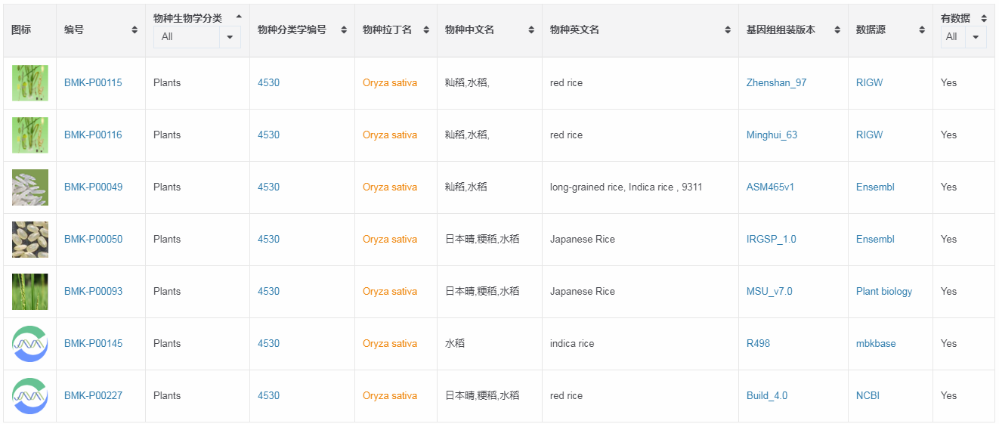
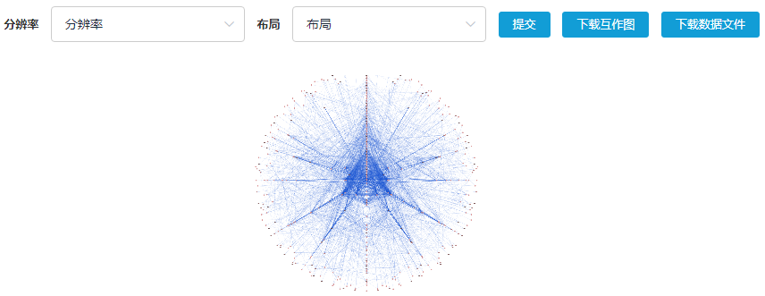
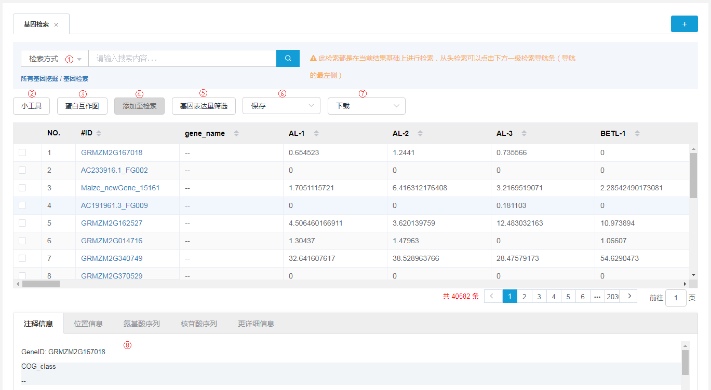
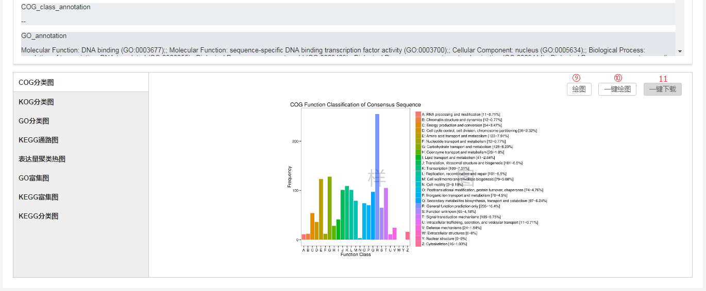

## 真核生物有参考基因组的转录组分析平台

`真核生物有参考基因组的转录组分析平台`（简称`有参转录组分析平台`），基于已知的基因组序列和注释信息，以NGS高通量转录组测序（RNA-Seq）数据作为输入，根据测序数据与参考基因组的序列比对，识别新的转录位点（新基因）、新的可变剪接事件，并对新旧基因进行结构分析、表达定量和差异表达分析。

包含分析内容：测序数据质量评估；测序数据与所选参考基因组的序列比对；确定外显子/内含子的边界，分析基因可变剪接情况；发掘未注释的基因区和新的转录本；识别转录区的SNP位点；修正已注释的5'和3'端基因边界；定量基因和转录本表达水平，识别不同样品（组）之间显著差异表达的基因并对其进行功能注释和富集分析。

### 基本分析

基本分析的基础使用方法可以参考[分析平台入门引导](workflow-help.md)，介绍了如何创建项目、如何导入数据、如何保存历史参数等等，此处仅介绍有参转录组分析平台使用时需要特别注意的一些地方。

##### 报告名称

根据本项目的一些关键信息设置报告名称，方便之后对报告进行区分，报告名称会体现在结题报告中。目前报告名称只支持中文、数字、字母、下划线、中横线、点，请不要输入其他字符，否则会导致任务失败。

##### 建库方式

常见的测序建库类型分为fr-unstrand（默认选项）、fr-firstrand、fr-scondstrand，fr-unstrand是非链特异性文库，fr-firstrand和fr-secondstrand为链特异性文库，用户可根据实际情况选择。具体说明如下：

* fr-unstrand：对于双端测序数据，配对reads中那一条与转录本的方向一致是随机的，如Illumina Truseq、Standard Illumina测序文库；

* fr-firststrand：对于双端测序数据，后测序的read2与转录本方向一致，如dUTP、NSR和NNSR测序文库；

* fr-secondstrad：对于双端测序数据，先测序的read1与转录本方向一致，如Directonal Illumina(Ligation) 和Standard Solid测序文库。

##### 选择参考基因组

目前收录的参考基因组见[已部署参考基因组](reference-genome.md)，对于依赖参考基因组序列进行分析的平台，一定要选择和分析数据对应的参考物种及组装版本，不同版本的参考基因组的详细信息可以点击`基因组版本详情`进行查看，选择参考基因组可以分以下几步：

1. 一定要选择与所研究种属最接近的参考基因组版本，以水稻为例，平台目前提供以下版本，看“物种英文名”那一列，可以知道该版本测得具体是哪个种：red rice？Indica rice？Japanese Rice？

2. 确定了种之后，有可能还需要区分亚种，如red rice的两个亚种：Zhenshan 97 and Minghui 63；

3. 确定了亚种之后，如果还有不同的组装版本，建议选择最新的版本即可，可以对应版本的详细介绍页面查看发布时间，如果还是搞不清楚，可以联系在线客服求助。

> **[warning]**
>
> 如果您之前已经用某个版本的参考基因组进行了第一批数据的分析，为了保证第二批数据的分析结果和第一批分析结果有可比性，一定要选择相同版本的参考基因组；如果第二批数据您想用最新版的参考基因组来做分析，那第一批数据应该也用最新的参考基因组重新分析一遍。

##### 差异表达分析FDR

FDR全称：false discovery rate，该阈值越低表示差异表达筛选越严格，筛选出来的差异表达基因越少，默认设置为0.01。

##### 差异筛选倍数阈值

差异筛选倍数，一般又称为FC（Fold Change），在对照组与实验组中，如果基因的表达量差异倍数超过此阈值，则认为该基因为差异表达基因，默认设置为2。

### 个性化分析

#### 所有基因挖掘

本部分分析内容都是基于该项目的所有基因进行的分析。

##### 基因检索

通过功能注释信息、基因ID、基因名称、序列信息、反向互补序列进行基因检索，对检索出的基因子集进行功能信息查看、序列下载、重新绘图等。

1. 选择不同的检索方式，程序会在总表对应的列中进行匹配，如基因ID对应总表的#ID列，基因名称对应gene_name列等。

    (1)支持同时检索多个关键词，换行输入即可，多个检索词间是“或”的关系，也就是说在一个基因的相关信息中检索出其中的任意一个关键词，则取出该基因；

    (2)进行基因ID检索时，一次性检索的基因ID太多，可以通过`上传基因ID文件`进行检索；
    
    (3)支持漏斗式检索，即后一次检索都是在当前基因集的基础上进行检索，从头检索可以点击下方一级检索导航条，也就是导航的最左侧；
    
    (4)想重新检索，可以点击打开新的页面进行分析。
2. 目前支持[蛋白序列同源分析工具](https://international.biocloud.net/zh/software/tools/detail/small/355)和[MEGA](https://international.biocloud.net/zh/software/tools/detail/small/8a8300b8545083a10154518fa412147e)，点击之后会跳转到对应工具页面，并将检索出的基因的核苷酸序列作为输入文件自动填充到输入文件位置。
3. 如果项目结果文件中存在这个文件`/个人数据/biomarker_project/项目结果目录/Needed_Data/PPI.txt`，点击`蛋白互作图`按钮后，等待几分钟可以绘制出如下互作图，支持修改分辨率和互作图展示方式，也可以下载绘制互作图的关系文件，供您自己进行重新绘图。

    > **[warning]**
    >
    > 浏览器只支持绘制互作关系20000对以下的互作图，超过20000对之后您只能下载数据后自己在本地进行绘制

    
4. 添加至检索，只有勾选了结果表格前边的复选框之后，选中基因之后才能激活该按钮，快速将选中的基因ID添加到检索框中，进行检索。
5. 基因表达量筛选，筛选出表达量在所选择样品中均在所设置阈值范围内的基因。
6. 保存是指将相关结果保存到云上，保存路径：`/个人数据/biomarker_project/项目结果目录/Personal_Analysis/自定义文件名`
    (1)列表保存:基因集表格
    (2)核苷酸序列保存：批量保存基因集对应的核苷酸序列
    (3)氨基酸序列保存：批量保存基因集对应的氨基酸序列，如果您的项目中没有进行氨基酸序列预测，则没有该选项
    (4)分析结果保存：是将本次分析结果保存到`研究进展记录`中，便于以后进行查看
7. 下载是指将相关结果下载到本地（自己电脑），同样支持下载基因集表格、对应核苷酸序列和氨基酸序列
8. 点击表格中的#ID列对应的基因ID，此处会展示该基因对应的注释信息、基因组上的位置信息、该基因的核苷酸序列、氨基酸序列，如果该基因收录到了[功能基因数据库](https://console.biocloud.net/static/index.html#/dataBase/genesIndex)中，则会有`更详细信息`这个切页，点击之后可以跳转到功能基因数据库，可以查看该基因更详细信息：功能数据、同源基因、表达数据、调控数据、变异数据等。
9. 点击`绘图`，基于筛选出的以上基因集，重新绘制当前类型的图片。
10. 点击`一键绘图`，则会自动开始绘制所有类型的图片。
11. 图片绘制结束之后，可以点击`一键下载`将所有绘图结果打包下载到本地。

##### 表达基因集维恩图

##### 基因名称替换

##### 表达量PCA分析

##### 相关性分析

##### WGCNA

#### 差异基因挖掘

本部分内容都是针对差异基因进行的分析。

##### 差异表达基因数目统计

##### 差异表达基因集查询

##### 差异表达基因集维恩图

##### 基因共表达趋势分析

#### 基因结构挖掘

##### PCA分析

##### 系统进化树

##### 样品间差异SNP筛选

##### 目标区域SNP查询

##### 转录因子预测

#### 更新结题报告

##### 样品和分组设置

##### 新结题报告展示