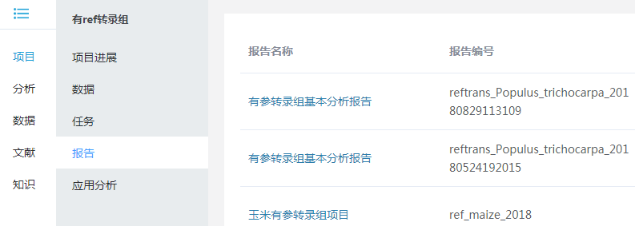
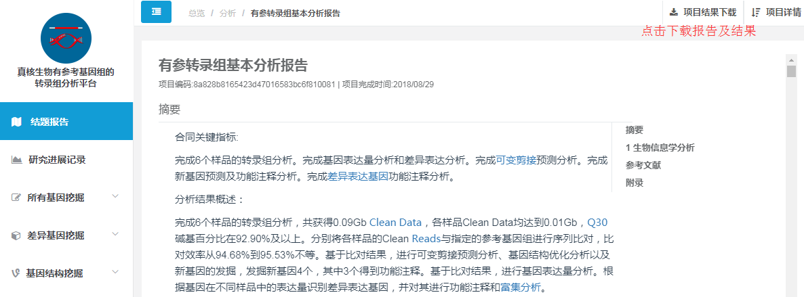
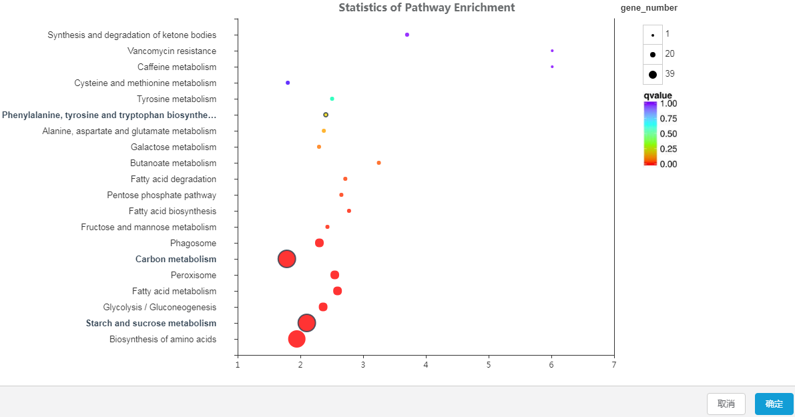

## 分析平台入门引导

目前百迈客云包含丰富的分析流程，涵盖转录组、非编码RNA、微生物、蛋白、代谢、联合分析等，通过这些分析流程，只需轻松几步，即可获得内容丰富的标准分析报告，再也不用等待科技服务公司排队进行分析。

### 轻松几步获取标准分析报告

**1. 选择合适的分析平台**

百迈客云包含农学和医学两大类分析平台，医学分析平台主要针对人、鼠数据的分析，包含：转录组、非编码RNA、单基因病外显子、肿瘤外显子、重测序等数据分析，以及全转录组联合分析；农学分析平台可以应用到更多的物种，涵盖转录组、非编码RNA、微生物、蛋白、代谢等数据的分析，以及全转录组联合分析等。点击左侧导航`分析`->`农学或者医学`打开分析平台列表页面，点击选择您想要使用的分析平台，打开其详细介绍页面，该页面可以看到该平台的`应用领域``平台介绍``技术背景``案例``课堂``版本记录`，点击`打开软件`即可进入到参数页面。

> **[info] 提示：**

> 1. 分析平台列表页，logo上带有`极速体验`标签的分析平台支持使用示例数据快速获取一份分析报告，并进行个性化功能体验，可以参考[分析平台极速体验](quick-use-workflow.md)

> 2. 分析平台显示`已购买`则可以进行自己数据的分析，显示为`未购买`则没有权限分析自己的数据，但仍可以进行`极速体验`

**2. 选择项目**

为了方便数据、任务和报告的管理，我们将同属于一个项目的内容会放到一个项目中，因此进行基本分析时需要先选择一个项目，如果没有项目也可以点击`+新建`先创建一个项目，见下图。

**3. 数据导入**

针对FASTQ测序数据，平台支持两种导入方式：
* 方式1：选择文件夹批量导入，双端测序数据必须分别以_1.fq和_2.fq结尾，系统便会自动对数据进行配对，而且多个目录中的文件可以分多次导入进来一起进行分析；
* 方式2：当有某一个样品的数据没有和大部分数据放在同一个文件夹时，可以通过方式2单独导入该样品的数据，双端数据只需导入一个文件，系统会自动识别出配对的另外一个文件导入进来。

导入数据之后，可以根据自己的需要修改样品ID，由于此处设置的ID会体现在分析报告和分析结果中，因此请慎重考虑后再设置，避免重新分析的麻烦。

如果平台上还没有您自己的数据，请参考[数据上传](../website-map/data-upload.md)先将您的数据传到云平台上。

> **[warning] 注意：**

> 1. 样品ID目前仅支持字母、数字、中横线，且必须以字母开头，长度不能超过9个字符。

> 2. `导入数据量`统计的是导入文件中包含的总碱基数，如果超过单次任务允许的上限，您可以通过工具：[按大小截取测序数据](https://international.biocloud.net/zh/software/tools/detail/small/8a8300b25beace85015bead6d9080041)批量将数据处理到符合要求的数据量。

> 3. 如果提示导入的数据没有`碱基数`这个属性，请点击页面右下角的`在线客服`头像，联系客服解决。

**4. 基本参数设置**

一般在这里选择生信流程版本、设置报告名称等基本参数。

**5. 选择参考基因组**

对于依赖参考基因组序列进行分析的平台，一定要选择和分析数据对应的参考物种及组装版本，不同版本的参考基因组的详细信息可以点击`基因组版本详情`进行查看。

**6. 差异分组设置**

根据样品信息，进行分组的设置，流程据此进行比较分析。

**7. 生成标准分析报告**

参数设置完成之后，可以点击`保存参数`，方便之后进行重新分析或者基于本次参数进行修改后再次分析；一切准备就绪后，点击`提交`将任务提交到百迈客云计算集群上，根据不同分析平台、不同数据量等待大概2小时到3周的时间完成项目分析，获取到标准分析报告。

报告查看，点击`项目（管理）` -> `我的项目`打开项目列表，找到之前提交任务时选择的项目，点击`项目名称`打开该项目，即可看到新生成的分析报告记录，点击`报告名称`查看详细报告。

点击报告右上角的`项目结果下载`，可以选择下载HTML报告、PDF报告和结果数据。HTML报告只包括分析报告的html文件及一个src文件夹，展示了部分结果；PDF报告是根据HTML报告转换而来，方便您进行报告打印；结果数据包含了项目中所有结果文件，一般比较大，请耐心等待下载。

[基本分析演示视频](https://img.biocloud.net/docs/workflow-on-bmkcloud/基本分析201806.mp4)

### 灵活多样的个性化功能，助力二次数据挖掘（以转录组分析平台为例）

**1. 内涵丰富的功能**

**2. 简洁的参数设置页面**

**3. 灵活的基因筛选方式**

a. 通过功能关键词、基因ID、基因名、序列信息等进行检索：

通过与绘制的图进行交互，筛选出目的基因，如在下图的KEGG通路富集图中，单击选中感兴趣的通路对应的圈，再点击`确定`就可以筛选出指定通路中富集的基因，目前支持交互的图包含：COG分类图、KOG分类图、eggNOG分类提、GO分类图、GO富集图、KEGG分类图、KEGG富集图、聚类热图、维恩图等。

**4. 多样的绘图类型**

包含柱状图：eggNOG、GO分类图、KEGG分类图，散点图：KEGG富集图、MA图、火山图，其他：热图、venn图、树形图、网络图、通路图等，所有图至少包含一类矢量图，如：PDF或者SVG。

**5. 分析结果保存和回显**

完成个性化分析之后，您可以将本次分析结果一一保存下来，方便之后再次查看。在个性化结果页面，点击`保存` -> `分析结果保存`，然后填写一些本次个性化的相关信息，点击保存按钮，即可以将分析结果保存到`研究进展记录`中，参考以下两幅图。

再次查看之前的分析结果，点击`研究进展记录`，找到刚才保存的那条记录，点击名称列，即可回显出刚才的分析结果。

